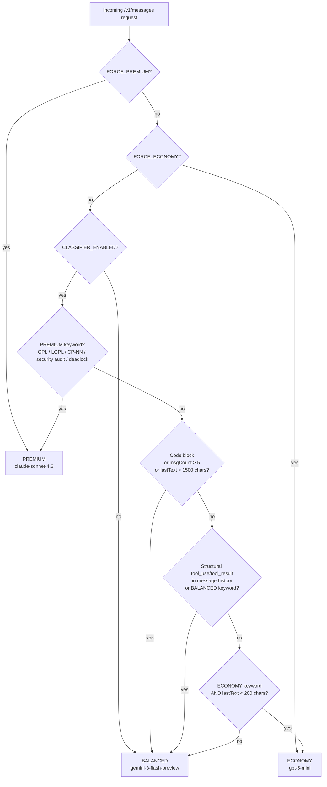

# Classifier Decision Flow

`custom-router.js` implements a zero-latency, zero-LLM-cost 3-tier classifier.
It is the `CUSTOM_ROUTER_PATH` target for CCR v2.0.0.

## Decision Tree



## Keyword Tables

### PREMIUM keywords (any match → PREMIUM)
| Keyword | Category |
|---|---|
| `gpl`, `lgpl`, `agpl` | Open-source license |
| `copyleft`, `derivative work` | License obligation |
| `license conflict`, `bison exception`, `legal review` | Legal analysis |
| `osc-evidence`, `oss-compliance`, `sbom conflict` | Compliance workflow |
| `security audit`, `threat model`, `cve-`, `vulnerability` | Security |
| `architectural decision`, `architecture review` | Architecture |
| `deadlock`, `race condition`, `memory leak`, `use-after-free` | Systems debugging |

**CP checkpoint regex:** `/\bcp-\d{1,2}\b/` — matches `CP-01` through `CP-15`

### BALANCED keywords (any match → BALANCED)
| Keyword | Category |
|---|---|
| `unit test`, `pytest`, `test coverage`, `tdd` | Testing |
| `sha256`, `hash match`, `cross-file` | Analysis |
| `cmakelists`, `dependency graph`, `sbom` | Build/compliance |
| `refactor`, `implement`, `generate` | Development |

### ECONOMY keywords (match + lastText < 200 chars → ECONOMY)
| Keyword | Category |
|---|---|
| `what is`, `quick question` | Lookup |
| `health check`, `ping` | Ops |
| `list files`, `show me` | Navigation |
| `format this`, `rename` | Janitor |

## Tier Mapping

| Tier | Provider | Model | Premium Units |
|---|---|---|---|
| ECONOMY | `copilot-economy` | `gpt-5-mini` (env: `COPILOT_MODEL_ECONOMY`) | 0x |
| BALANCED | `copilot-balanced` | `gemini-3-flash-preview` (env: `COPILOT_MODEL_BALANCED`) | 0x |
| PREMIUM | `copilot-premium` | `claude-sonnet-4.6` (env: `COPILOT_MODEL_PREMIUM`) | 1x |

**Default:** BALANCED (safe 0x fallback — a misclassification is always free)

## Log Output

Each classified request emits:
```
[Classifier] tier=BALANCED → copilot-balanced,gemini-3-flash-preview
```

Visible in `/tmp/ccr.log` and the sidecar dashboard tier histogram.
